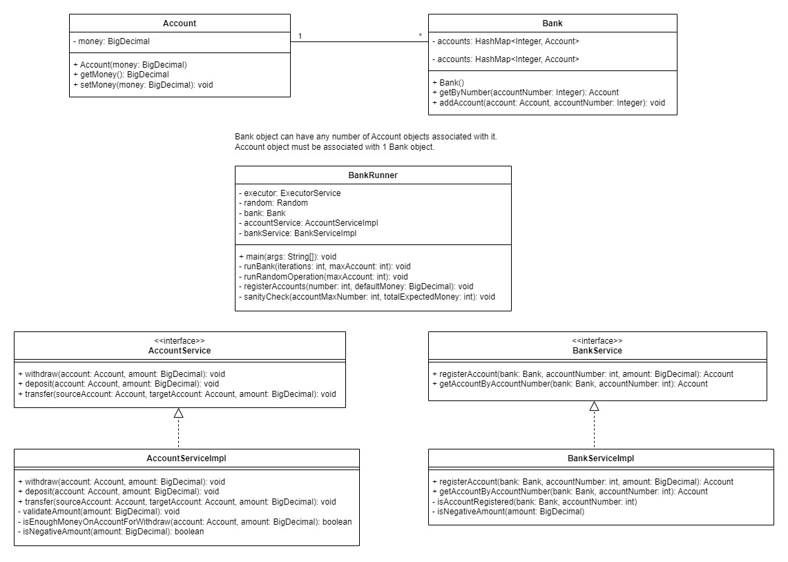

# Fix and refactor

##  Simple bank 

The application is built using 2 classes. 

Account class models how much money a person has. Two main methods are
deposit and withdraw. Account may never have negative deposit. (There is an if statement preventing that).
Bank class models registering account and getting existing account (by id). 

Both classes have a lot of bugs.

## Simulation

There is a 3rd class BankRunner which has a main method.  
This class runs a simulation, where some number of accounts is created.
Then some random transfers are done. This is performed using multiple threads.  
After that the overall amount of money on accounts should not change.

This seems not to be the case.

##  Task

Your job is to find bugs and other problems in the implementation.
1. Make corrections to the Account and Bank classes. (if you do not have time, please simply list the problems that you see).
2. You may also have to change BankRunner class! In such case, please try to preserve its intended logic.
3. Additionally try to fix or list other potential code quality issues that you see.
4. You are free to create additional classes or files as needed.

### Corrections

1. The money type was changed from double to BigDecimal. Using double for currency calculations and converting it to BigDecimal at the end can lead to precision issues with floating point arithmetic calculations. It's better to use BigDecimal.
2. Exception in thread "main" java.lang.IllegalStateException: we got 106464.2525134140081615 != 100000 (expected) at ch.engenius.bank.BankRunner.sanityCheck(BankRunner.java:65) at ch.engenius.bank.BankRunner.main(BankRunner.java:26). This issue was solved using synchronized blocks to synchronize withdraw and deposit methods (keyword synchronized was used on code block and method levels). This ensures that only one thread can modify the account money at a time. This ensures thread safety and prevents account money from being corrupted after transfers.
3. The account and bank logic were moved to AccountService and BankService services, respectively. This improves maintainability, enhances modularity, promotes reusability and simplifies testing. Also, it abstracts implementation details. The logic of withdraw and deposit were moved to the AccountService. The logic of account registering was moved to the BankService.
4. In runRandomOperation() method the deposit method was called first, and then the withdraw method. The order of these two methods was changed, because the correct way is to first withdraw and then deposit the money. Also, the withdrawing and then depositing the money was moved to a separate transfer method in the AccountService service, as it is an action that will often be performed.
5. The System.out.println() and e.printStackTrace() were changed to use Logger which allows better log message handling on various log levels.
6. If an InterruptedException is not handled properly, the information that the thread was interrupted will be lost. Handling this exception means either to re-throw or re-interrupt the current thread. The Thread.currentThread().interrupt() method call re-interrupts the current thread.
7. Added JUnit tests, test suite, javadoc comments and .gitignore.
8. Added class diagram.

